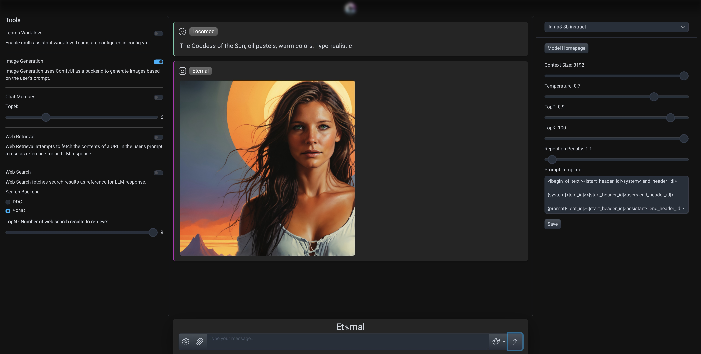
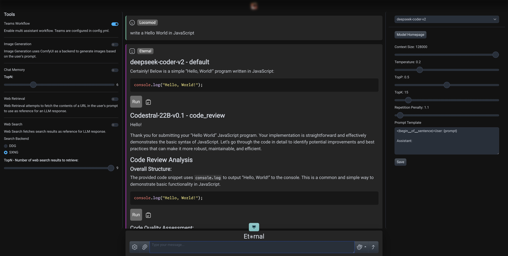
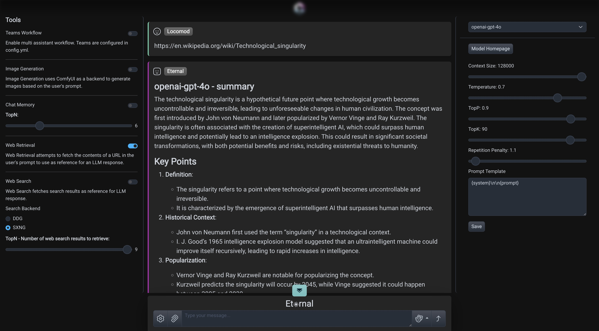
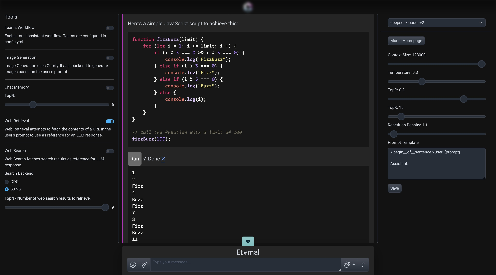
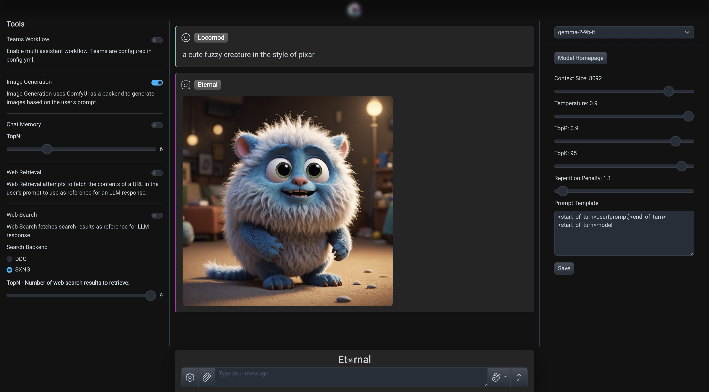
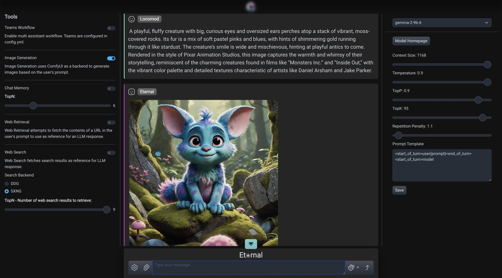

<div align="center">
  <picture>
    <source media="(prefers-color-scheme: dark)" height="200px" srcset="./public/img/eternal.png">
    
  </picture>
</div>

# Eternal

Eternal is an experimental platform for machine learning workflows.

<div align="center">
  <picture>
    <source media="(prefers-color-scheme: dark)" style="width: 100%; height: auto;" srcset="./public/img/chat_s.jpg">
    
  </picture>
</div>
<br>
<br>
<div align="center">
  <picture>
    <source media="(prefers-color-scheme: dark)" style="width: 100%; height: auto;" srcset="./public/img/teams_s.jpg">
    
  </picture>
</div>

NOTE: This app is a work in progress and not stable. Please consider this repo for your reference. We
welcome contributors and constructive feedback. You are also welcome to use it as reference for your own projects.

Eternal integrates various projects such as `llama.cpp`, `ComfyUI` and `codapi` among many other projects whose
developers were kind enough to share with the world. All credit belongs to the respective contributors of all dependencies this
repo relies on. Thank you for sharing your projects with the world.

The Eternal frontend is rendered with the legendary `HTMX` framework.

IMPORTANT:

Configure the quant level of the models in your `config.yml` appropriately for your system specs. If a local fails to run, investigate the reason by viewing the generated `main.log` file. The most common reason is insufficient RAM or incorrect prompt template. We will implement more robust error handling and logging in a future commit.

## Features

- Easy ML model configuration and download. See default model catalog example in `.config.yml`
- Text generation using local language models such as Llama-3-8b-Instruct by Meta, Codestral by Mistral AI and powerful public OpenAI GPT-4o, Anthropic Sonnet 3.5, Google Gemini. (Public models require your own API keys)
- Web retrieval that fetches URL content for LLM to reference.
- Web Search to automatically retrieve top results for a user's prompt for LLM to reference. _Requires Chrome browser installation. The browser does not need to be opened as Eternal will manage a headless instance automatically._
- Advanced image generation using ComfyUI backend with custom workflows. Eternal will deploy and manage ComfyUI automatically.

## Getting Started

Basic [documentation](https://github.com/intelligencedev/eternal/blob/main/docs/general_instructions.md) is provided in the `docs` folder in this repository.

## Showcase

### Web Retrieval - Search 

- `webget`: Attempts to fetch a URL passed in as part of the prompt.
- `websearch`: Searches the public web for pages related to your prompt.

_Requires Chrome browser installation._

<div align="center">
  <picture>
    <source media="(prefers-color-scheme: dark)" style="width: 100%; height: auto;" srcset="./public/img/web_s.jpg">
    
  </picture>
</div>

### Code Execution

Execute and edit LLM generated code in the chat view in a secure sandbox. For now, JavaScript is implemented via WASM. More languages coming soon!

<div align="center">
  <picture>
    <source media="(prefers-color-scheme: dark)" style="width: 100%; height: auto;" srcset="./public/img/code_s.jpg">
    
  </picture>
</div>

### Image Generation

Eternal can generate images using powerful custom ComfyUI workflows that are automatically managed and tuned for high quality output. No more tweaking hundreds of parameters. Describe and generate. Set the role to `image_bot` and select any local or public LLM to enhance your prompts.
<div align="center">
  <h5>Basic image prompt</h5>
  <picture>
    <source media="(prefers-color-scheme: dark)" style="width: 100%; height: auto;" srcset="./public/img/imggen1_s.jpg">
    
  </picture>
  <h5>Large language model enhanced prompt</h5>
  <picture>
    <source media="(prefers-color-scheme: dark)" style="width: 100%; height: auto;" srcset="./public/img/imggen2_s.jpg">
    
  </picture>
</div>

## Configuration

Rename the provided `.config.yml` file to `config.yml` and place it in the same path as the application binary. Modify the contents for your environment and use case.

## Build

Eternal currently supports building on Linux or Windows WSL using CUDA (nVidia GPU required) or MacOS/Metal (M-series Mac required).

To build the application:
```
$ git clone https://github.com/intelligencedev/eternal.git
$ cd eternal
$ git submodule update --init --recursive
$ make all
```

Please submit an issue if you encounter any issues with the build process.

## Troubleshooting

It is recommended that a new Python 3.10 conda environment and virtual environment be created prior to initial application launch. This will avoid error messages related to required package installations such as `error: externally-managed-environment`.

If Eternal fails to launch, run the following commands to configure a new Conda environment and Python venv:
```
$ conda create -n eternal python=3.10
$ conda activate eternal
$ python python-m venv .
$ source bin/activate

# Apply execute permissions
$ sudo chmod +x ./eternal

# Run the Eternal binary
$ ./eternal
```

NOTE: Remember to rename the included `.config.yml` to `config.yml`, modify the settings for your environment, and save the file in the same path as the Eternal binary.

## Disclaimer

This README is a high-level overview of the Eternal application. Detailed setup instructions and a complete list of features, dependencies, and configurations should be consulted in the actual application documentation.