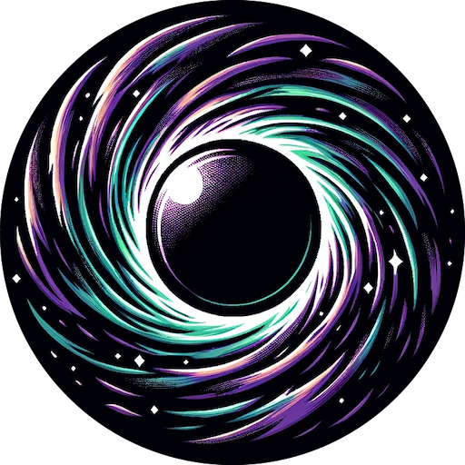

<div align="center">
  <picture>
    <source media="(prefers-color-scheme: dark)" height="200px" srcset="./public/img/eternal.png">
    
  </picture>
</div>

# Eternal

Eternal is an experimental platform for machine learning workflows.

<div align="center">
  <picture>
    <source media="(prefers-color-scheme: dark)" height="400px" srcset="./public/img/textcompletions.png">
    
  </picture>
</div>

NOTE: This app is a work in progress and not stable. Please consider this repo for your reference. We
welcome contributors and constructive feedback. You are also welcome to use it as reference for your own projects.

Eternal integrates various projects such as `llama.cpp`, `stable diffusion.cpp` and `codapi` among many other projects whose
developers were kind enough to share with the world. All credit belongs to the respective contributors of all dependencies this
repo relies on. Thank you for sharing your projects with the world.

## Features

- Language model catalog for easy download and configuration.
- Text generation using local language models or OpenAI API.
- Web retrieval that fetches URL content for LLM to reference.
- Web Search to automatically retrieve top results for a user's prompt for LLM to reference.
- Image generation using Stable Diffusion backend.

## Showcase

<div align="center">
  <picture>
    <source media="(prefers-color-scheme: dark)" height="400px" srcset="./public/img/modelcards.png">
    
  </picture>
</div>

<div align="center">
  <picture>
    <source media="(prefers-color-scheme: dark)" height="400px" srcset="./public/img/imagegen.png">
    
  </picture>
</div>

## Configuration

Rename the provided `.config.yml` file to `config.yml` and place it in the same path as the application binary. Modify the contents for your environment and use case.

## Build

Eternal currently supports building on Linux or Windows WSL using CUDA (nVidia GPU required) or MacOS/Metal (M-series Max required).

To build the application:

```
$ git clone https://github.com/intelligencedev/eternal.git
$ make all
```

Please submit an issue if you encounter any issues with the build process.

## Disclaimer

This README is a high-level overview of the Eternal application. Detailed setup instructions and a complete list of features, dependencies, and configurations should be consulted in the actual application documentation.
